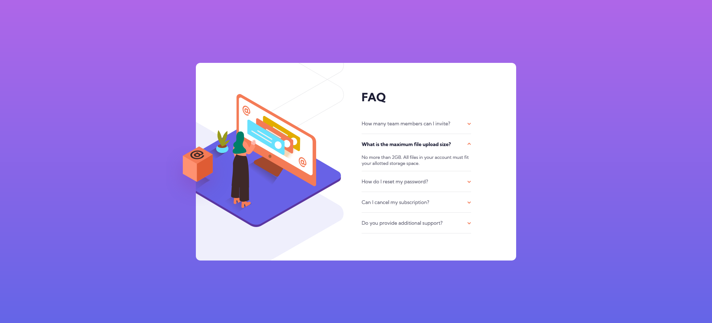
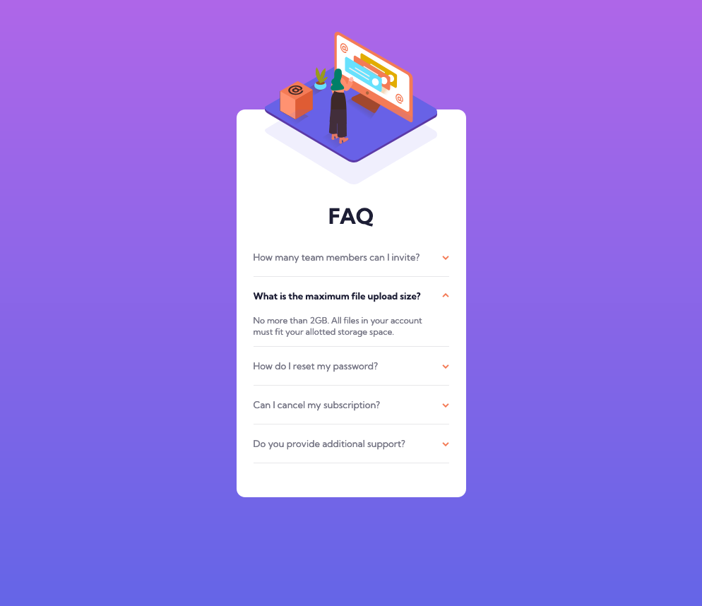

# Frontend Mentor - FAQ accordion card solution

This is a solution to the [FAQ accordion card challenge on Frontend Mentor](https://www.frontendmentor.io/challenges/faq-accordion-card-XlyjD0Oam). Frontend Mentor challenges help you improve your coding skills by building realistic projects. 

## Table of contents

- [Overview](#overview)
  - [Screenshots](#screenshots)
  - [Links](#links)
- [My process](#my-process)
  - [Built with](#built-with)
  - [What I learned](#what-i-learned)
  - [Continued development](#continued-development)
- [Mentions](#mentions)
- [Author](#author)

---

## Overview

### Screenshots
Desktop

Mobile



### Links

- Solution Frontend Mentor: [Frontend solution](https://www.frontendmentor.io/solutions/social-proof-section-HOrJECzrEk)
- Live Site: [Live site with GitHub Pages](https://marioferrer.github.io/FM-08_social-proof/)

## My process

### Built with

- HTML5
- CSS custom properties
- Flexbox
- BEM
- SCSS

### What I learned

I have learned how to make an accordion effect without JS using "input" and "label" elements and their ":checked" state. I could have used radio inputs to make it more dynamic but using checkbox the user can display as many as he wants.
Here is an example, the code is this:

HTML
```html
<div class="tab">
  <input type="checkbox" id="check1">
  <label class="tab__label" for="check1">How many team members can I invite?</label>
  <p class="tab__p">You can invite up to 2 additional users on the Free plan. There is no limit on team members for the Premium plan.</p>
</div>
```

SCSS
```scss
input {
  position: absolute;
  opacity: 0;

  &:checked {
    +.tab__label {
      color: var(--dark-blue);
      font-weight: 700;
    }

    +.tab__label::after {
      transform: rotate(180deg);
    }

    ~.tab__p {
      max-height: 100vh;
      padding: 0 1rem 1rem 0;
    }
  }
}
```

### Continued development

I have not been able to make the box move in desktop mode when hovering on the accordion titles. I've tried using JS as well but haven't found the solution and with CSS I can't reference a previous element with a selector.

### Mentions

I have used and modified Eduardo Fierro's reset, here is his github profile. <br>
[Eduardo's github profile](https://github.com/eduardofierropro/Reset-CSS)

## Author

- Github - [My GitHub Profile](https://github.com/marioferrer)
- Frontend Mentor - [@marioferrer](https://www.frontendmentor.io/profile/marioferrer)


